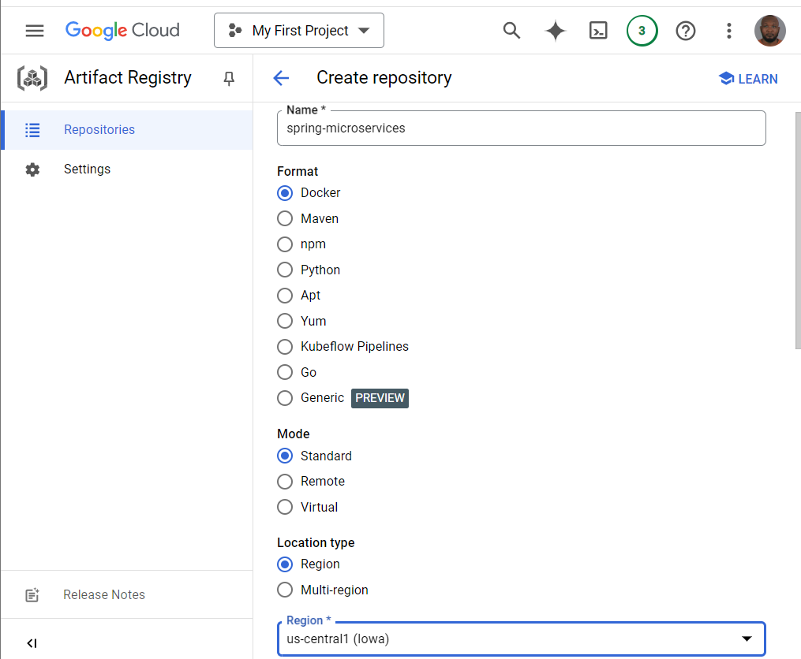
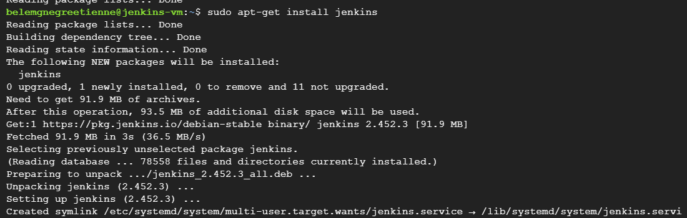
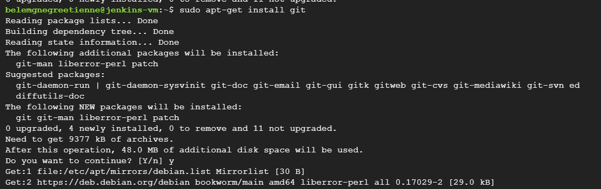
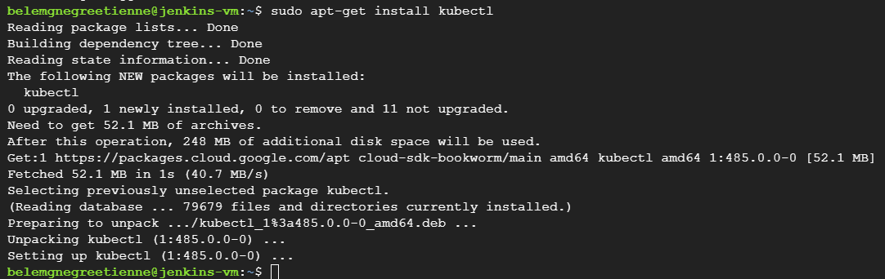
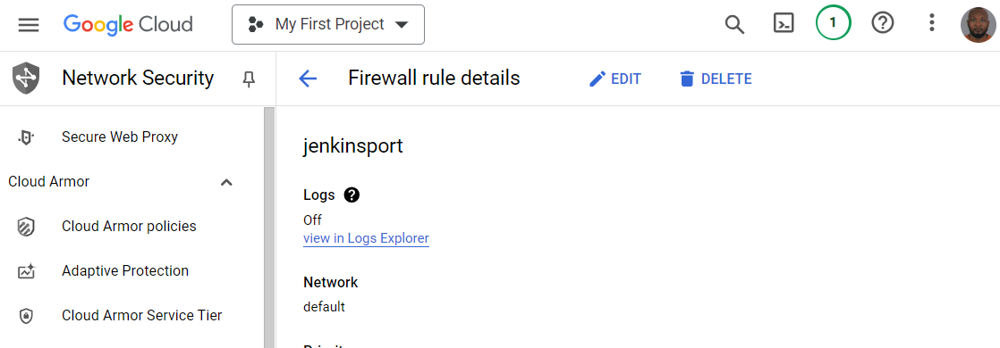
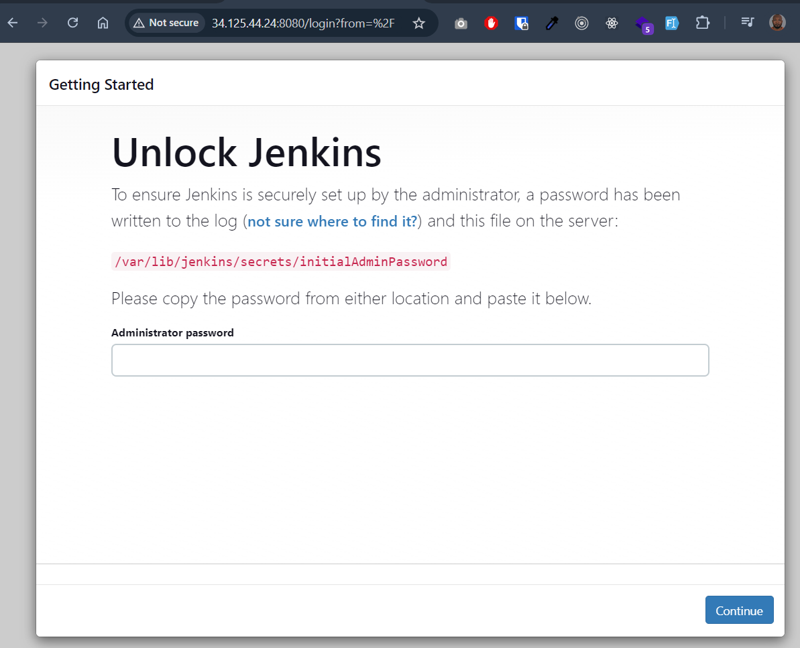
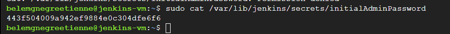
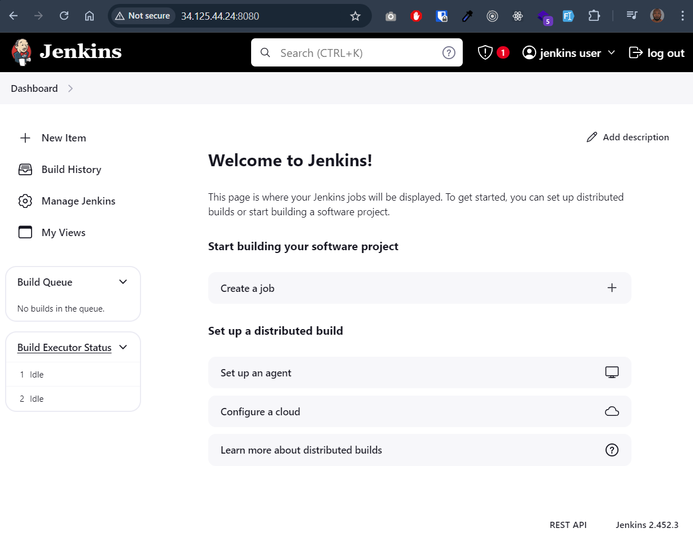

# devops-ci-cd-SpringBootCloudDockerK8s
Create a build/deploy pipeline for a Spring Boot application through : 
- setting up a pipeline for the Spring Boot application hosted on GitHub, 
- building it using Jenkins, 
- and deploying it to an Google Cloud Platform Service (GCP).

## Prerequisites:
- A Spring Boot application hosted on GitHub.
- [Google Cloud Account](https://console.cloud.google.com/) with ??? and ??? services set up.
- Jenkins Server: A running Jenkins server. You can set this up on a VM instance in GCP.

## 1 - Enable Kubernetes API on GCP

## 2 - Creating VM instances.

## 3 - Using SSH : installing Java openjdk, Jenkins, git and kubectl.
- Install Java 17
```
> sudo apt-get install openjdk-17-jdk
```

- Install Jenkins using the below steps.
```
> curl -fsSL https://pkg.jenkins.io/debian-stable/jenkins.io.key |
sudo tee \
/usr/share/keyrings/jenkins-keyring.asc > /dev/null
echo deb [signed-by=/usr/share/keyrings/jenkins-keyring.asc] \
https://pkg.jenkins.io/debian-stable binary/ | sudo tee \
/etc/apt/sources.list.d/jenkins.list > /dev/null

> sudo apt-get update

> sudo apt-get install jenkins
```

- Install git which is required :
```
> sudo apt-get install git
```

- Install kubectl
```
> sudo apt-get install kubectl
```

## 4 - Configure network
- Create firewall rule to allow traffic on port tcp:8080
-  
## 4 - Setting up Jenkins
First, you need to access to your VM instance. Go to the VM created, then copy **External IP** and paste it on the browser : 

- To get the password 

- Copy, paste the password to get started the initial configuration. 
- Then install all the recommend plugins before accessing to the dashboard.
 
## 5 - Creating JenkinsFile for each app.

## 6 - Deploy Kubernetes.
