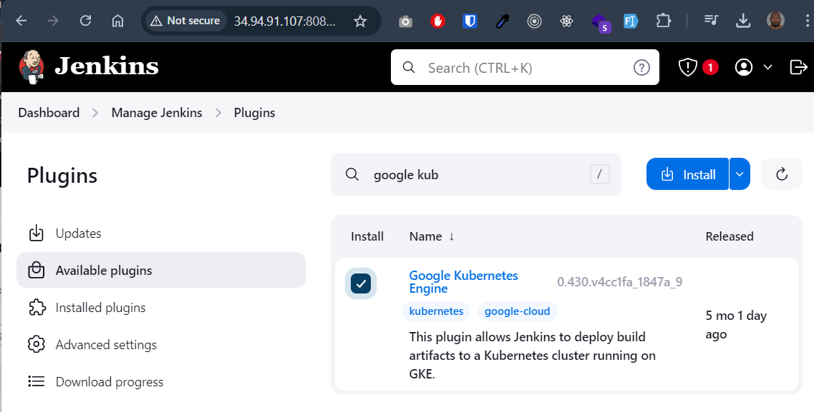
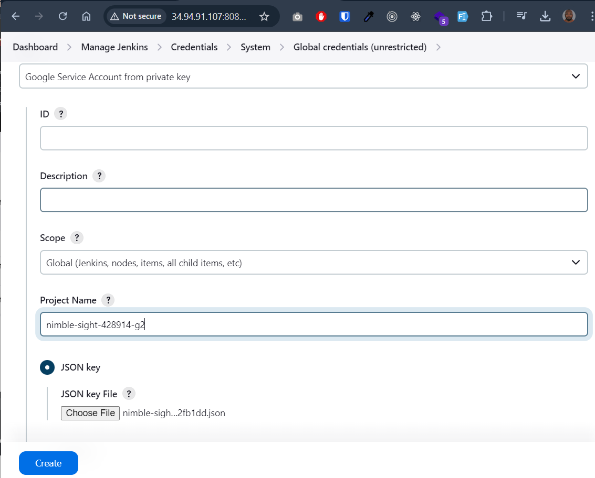

# CI/CD pipeline set up using Jenkins, Spring Boot, Google Cloud (GCP), Artifact Registry, Kubernetes (K8s), Github, and Docker.


[Here’s a step-by-step explanation](#8---flow-and-components-explained) of how a CI/CD pipeline can be set up, build then deploy to a Google Cloud Platform Service.

## Prerequisites:
- A Spring Boot application hosted on Github.
- A [Google Cloud Account](https://console.cloud.google.com/).

## To Set Up the Environment
- Create a new project in the GCP console.
- Set up  VM (virtual machines) to install Jenkins Server. 
- Create a GKE (Google Kubernetes Engine) cluster. 
- Use Artifact Registry to store the images (of Docker).

## 1 - Enable Kubernetes Engine API on the Google Cloud Platform (GCP). 
Kubernetes Engine API is a service provided by GCP that allows users to manage and interact with Kubernetes clusters.


## 2 - Creating VM instances.

## 3 - Using SSH : installing Java openjdk, Jenkins, git and kubectl.
Open SSH in browser window to run commands


- Install Java 17

Java is required to install and run Jenkins because Jenkins itself is built on Java.
```
> sudo apt-get install openjdk-17-jdk
```


- Add the Jenkins GPG key:
```
> curl -fsSL https://pkg.jenkins.io/debian-stable/jenkins.io-2023.key | sudo tee /usr/share/keyrings/jenkins-keyring.asc > /dev/null
```

- Add the Jenkins repository:
```
echo deb [signed-by=/usr/share/keyrings/jenkins-keyring.asc] https://pkg.jenkins.io/debian-stable binary/ | sudo tee /etc/apt/sources.list.d/jenkins.list > /dev/null
```

- Update the package list, then Install Jenkins:

```  
> sudo apt-get update

> sudo apt-get install Jenkins
```


- Install git :
  
By installing Git in Jenkins, you enable Jenkins to interact with Git repositories, clone code, and perform various operations such as checking out specific branches, pulling updates, and pushing changes.
```
> sudo apt-get install git
```


- Install kubectl : to enable Jenkins to interact with Kubernetes clusters and perform operations such as deploying applications, managing pods, and executing commands on the cluster.
```
> sudo apt-get install kubectl
```

## 4 - Configure network
- Create firewall rule to allow traffic on port tcp:8080


 
## 4 - Setting up Jenkins
First, we need to access to wer VM instance. Go to the VM created, then copy **External IP** and paste it in the browser on the port we configured on firewall : 


- To get the password 

- Copy, paste the password to get started the initial configuration. 


- Then install all the recommend plugins before accessing to the dashboard.

 

- Add git & maven


- To connect Github to Jenkins, we need to create a personal token on Github then add it as new credential on Jenkins (paste the token copied in password field) :
**NB: the id "git" use here is the same when adding git tool.**


- When Jenkins is deploying to K8s, it has to connect to GCP, so, let's create a service account (in IAM), so Jenkins will use this service account to authenticate securely to GCP :


- Install Google Kubernetes Plugin in Jenkins, this plugin allows Jenkins to deploy build artifacts to a Kubernetes cluster running on Google Kubernetes Engine - GKE :



- Go back to the Service Account added and create and download a json key from Keys section. 


- Upload it as a new credential (type : secret file) to Jenkins. This credential is used for general authentication with GCP services in Jenkins pipelines. 

 

- And this second one is most likely used for general authentication to our GCP project 
  



## 5 - Setting K8s Cluster and Other Jenkins settings
- Create a K8s cluster on GCP


- Add environment variables in Jenkins for ARTIFACT_REPOSITORY, CLUSTER, PROJECT_ID, REGISTRY_URL and ZONE :


## 6 - Creating JenkinsFile for each app.
This Jenkins pipeline script automates the end-to-end process of checking out the source code, building a Docker image, pushing it to a repository, and deploying it to a Kubernetes cluster. 


## 7 - Deploy Kubernetes.

## 8 - Flow and Components Explained
1. Source Code Management (Github)
- Github is used as the version control system where wer Spring Boot application's source code is hosted. Developers push their changes to the main branch (or any other branch) in a Github repository.
2. Continuous Integration (Jenkins)
- Jenkins is the CI/CD server that automates the build, test, and deployment process.
- When a developer pushes code to Github, it triggers a Jenkins pipeline. This can be set up using webhooks or a Jenkinsfile in the repository.
3. Checkout Code (Jenkins Stage)
- Jenkins checks out the latest code from the specified branch in the Github repository.
- This code will typically include the Spring Boot application and any necessary configuration files (e.g., application.properties, pom.xml, etc.).
4. Build the Application (Maven)
- Jenkins uses Maven to build the Spring Boot application. The build process involves:
  - Compiling the code.
  - Running unit tests.
  - Packaging the application into a JAR file.
  - This is done using the mvn clean install command, which is part of the Jenkins pipeline script. Maven's configuration is defined in the pom.xml file.

5. Containerize the Application (Docker)
- The Spring Boot application is then containerized using Docker. This involves:
  - Writing a Dockerfile that defines how the Spring Boot application should be packaged into a Docker image.
   - Using a tool like Jib (as mentioned in wer pipeline) to build the Docker image directly from the Maven build without needing a Docker daemon.
6. Push Docker Image to Artifact Registry
- Once the Docker image is built, it needs to be stored in a container registry. In this case, we're using Google Artifact Registry.
- Jenkins authenticates with Google Cloud using service account credentials and pushes the Docker image to the Artifact Registry. This is done using the gcloud auth commands and the jib:build Maven goal.
-  The image is now available in the Artifact Registry, tagged with the appropriate version or latest tag.
7. Update Kubernetes Manifest (Jenkins Stage)
- The Kubernetes deployment manifest (deployment.yaml) contains the configuration for deploying the application to a Kubernetes cluster.
-  Jenkins replaces the placeholder for the Docker image URL in the deployment.yaml file with the actual image URL from the Artifact Registry.
8. Deploy to Kubernetes (GCP Kubernetes Engine)
-  Jenkins uses the kubectl command or a Kubernetes plugin to deploy the updated application to the Google Kubernetes Engine (GKE) cluster.
-  The deployment process involves:
   - Updating the Kubernetes Deployment with the new Docker image.
   - Rolling out the updated pods to ensure zero-downtime deployment.
9. Continuous Deployment
- Once deployed, the new version of the application is running on the Kubernetes cluster.
- Jenkins can be configured to notify the team of the successful deployment, or it can trigger further tests (e.g., integration tests or smoke tests) to validate the deployment.
10. Monitoring and Feedback
- After deployment, the application is monitored using tools like Google Cloud Monitoring, Prometheus, or Grafana.
- Feedback from monitoring can be used to trigger rollbacks or further improvements in the CI/CD pipeline.
    
11. Summary of Key Components:
    - Github: Version control for source code.
    - Jenkins: Automates the CI/CD process.
    - Spring Boot: The application framework used to build the application.
    - Maven: Tool for building and managing Java-based projects.
    - Docker: Containerizes the application.
    - Google Artifact Registry: Stores Docker images.
    - Kubernetes (GKE): Orchestrates and manages the containerized applications.
    - Google Cloud (GCP): Cloud platform hosting the infrastructure, including Kubernetes and Artifact Registry.
